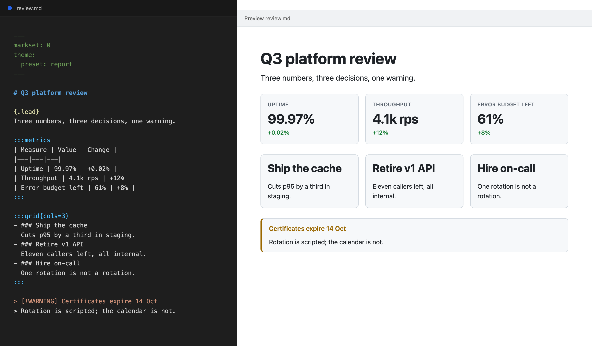

# Markset for Visual Studio Code

**Write Markdown. Get a designed document.**

Markset is Markdown plus eight layout constructs: cards, grids, columns, tabs, steps, metrics, figures, and callouts. Every Markdown file you already have is a valid Markset document. This extension renders them in the Markdown preview you already use, offers every construct as you type, and tells you the moment something is wrong.



## Write this

```markdown
:::metrics
| Measure | Value | Change |
|---|---|---|
| Uptime | 99.97% | +0.02% |
| Throughput | 4.1k rps | +12% |
:::

:::grid{cols=3}
- ### Ship the cache
  Cuts p95 by a third in staging.
- ### Retire v1 API
  Eleven callers left, all internal.
- ### Hire on-call
  One rotation is not a rotation.
:::

> [!WARNING] Certificates expire 14 Oct
> Rotation is scripted; the calendar is not.
```

Then click the preview icon you always click. The metrics become a strip of big numbers with colored deltas, the list becomes three cards, and the callout becomes a callout. Paste the same file into a GitHub comment and it still reads, top to bottom, as a table, a list, and a quote. Nothing is lost either way.

## What you get

- **The preview you already have, rendering Markset.** No second preview to find. On a file that declares `markset:`, the standard Markdown preview shows the document with its layout. Every other Markdown file is left exactly as it was.
- **Every construct at your fingertips.** Type `:::` at the start of a line and all eight are offered, each inserting a working example. Type `> [!` and the five callout types appear. Snippets for `card`, `grid`, `tabs`, `figure`, `diagram`, `chart` and the rest are there too, and every one is a case from Markset's own test suite, so a snippet can never insert something the parser rejects.
- **Mistakes caught as you type.** A misspelled `:::cards` is underlined where it happens, with the reason and a link to the specification. A `grid` that holds something other than a list, a `columns` with only one column, a chart on something that is not a table: each is reported before anyone else sees it.
- **Diagrams and charts, drawn.** An `ascii` fence inside a captioned figure becomes a picture with nothing configured. A figure marked `chart=line`, `bar` or `column` draws its table as a chart, in your theme's colors. Mermaid renders through the *Markdown Preview Mermaid Support* extension if you have it, or through any command you name in `markset.diagrams`.
- **See what everyone else sees.** *Markset: Show as Plain CommonMark* opens the document as a reader on GitHub or in any other Markdown tool gets it, so the fallback is never a surprise.
- **A preview of its own, when you want one.** *Markset: Open Preview to the Side*, the eye icon in the editor title, or the **Markset** item in the status bar. It follows your light or dark theme and can take a theme stylesheet of your own.
- **Highlighting** for fences, `::col`, attribute lines, spans and callout markers, on top of the Markdown coloring you already have.

Nothing in the preview runs. A rendered Markset document never contains a script; tabs switch with radio inputs and callouts fold with `<details>`. What you see in the editor is exactly what the `markset` command line tool renders and exactly what the [markset.org](https://markset.org/) site is built from.

## Settings

| Setting | Default | What |
|---|---|---|
| `markset.checkAllMarkdown` | `false` | Check every Markdown file, not only those with a `markset:` line in their frontmatter. |
| `markset.builtInPreview` | `true` | Render Markset documents in the built-in Markdown preview. |
| `markset.diagrams` | `{}` | Commands that draw diagram fences by language, for example `{ "mermaid": "mmdc -i /dev/stdin -o /dev/stdout" }`. The fence goes to the command's standard input; the SVG comes back on its output. |
| `markset.preview.theme` | `""` | A theme stylesheet appended after the default in the extension's own preview. Relative to the workspace folder. |

A Markset document names the specification version it is written against with `markset: 0` in its frontmatter, and by default that line is what turns the extension on for a file. It is a version, not a switch: zero is the zeroth specification, not off.

## Learn more

- [markset.org](https://markset.org/) has the reference, one page per construct, with live examples.
- The [playground](https://markset.org/playground/) runs this same implementation in your browser.
- The [command line tool](https://markset.org/cli/) renders documents in a build step or a GitHub Pages workflow.
- The extension's source is in the [Markset repository](https://github.com/markset-lang/markset/tree/main/editors/vscode), where `PUBLISHING.md` describes releases.

MIT.
