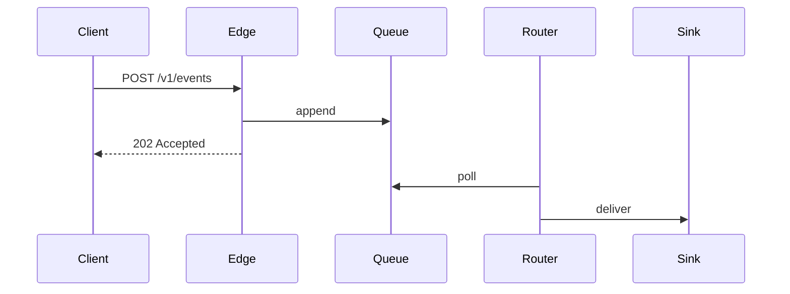

{.eyebrow}
Architecture overview · revision 11

# How Tidewater fits together

{.lead}
Tidewater takes events from anything that can open a socket and puts them where they need to go, at about four million a minute on a normal weekday. This page is the map: what the parts are, how a single event moves through them, and which of the obvious designs we did not pick. It is the page to read before your first change, and the one to argue with when the shape stops fitting.

[Revision 11]{.badge .info} [Owners: Platform]{.badge} [Invented system]{.badge .warn}

> [!NOTE]
> **Every picture here is text.** The diagrams are ASCII fences in the source of this file. They are drawn when the page is rendered and they read as diagrams when it is not — in a pull request, in a terminal, in a mail thread. Nothing below is an image file anyone has to keep in step with the prose.

{.tick}
***

{.eyebrow}
The shape of it

## Three tiers, one direction

Events move left to right and never back. That is the single most useful thing to know about the system, and most of the surprises people hit come from assuming otherwise.

:::figure[Tidewater end to end. Collectors accept, the core decides, sinks deliver. Nothing flows right to left.]{#fig-overview}
```ascii
           collectors           core                       sinks

      +------------+                                  +---------------+
      |    HTTP    |-----+                       +--->|   Warehouse   |
      +------------+     |                       |    +---------------+
                         |                       |
      +------------+     |    +------------+     |    +---------------+
      |   Syslog   |-----+--->|   Router   |-----+--->|   Alerting    |
      +------------+     |    +------------+     |    +---------------+
                         |                       |
      +------------+     |                       |    +---------------+
      |   Agent    |-----+                       +--->|    Archive    |
      +------------+                                  +---------------+
```
:::

:::grid{cols=3}
- ### Collectors

  Accept an event, stamp it with a receive time, and write it to the queue. They do no parsing and hold no state, so a collector can be replaced mid-flight and nobody notices.

- ### Router

  Reads the queue, evaluates the routing table, and decides which sinks an event is owed to. This is the only tier that knows what an event *means*, which is why it is also the only tier with a deploy freeze during incidents.

- ### Sinks

  Own delivery, including retries and backoff. A slow sink cannot slow the router, because the router's job ends when the fan-out is written.
:::

{.tick}
***

{.eyebrow}
One event

## What a delivery attempt does

Every event gets one row per sink it is owed to, and each row walks this state machine independently. Two sinks failing are two separate stories.

:::figure[The states of a single delivery row. A retry re-enters at the top, so the row carries its own attempt count rather than a timer.]{#fig-states}
```ascii
   +-----------+
   |  queued   |
   +-----------+
         |
         v
   +-----------+        +---------------+
   |  sending  |------->|   delivered   |
   +-----------+        +---------------+
         |
         v
   +-----------+        +---------------+
   |  failed   |------->|    dropped    |
   +-----------+        +---------------+
         |
         | backoff, attempt + 1
         v
   +-----------+
   |  queued   |
   +-----------+
```
:::

A row reaches `dropped` in exactly two ways: the sink returned something we are told not to retry, or the attempt count hit its ceiling. There is no third path, and adding one has been proposed twice.

:::figure[What each terminal state means for the people downstream.]
| State | Reached when | Who finds out |
|---|---|---|
| `delivered` | The sink acknowledged the write | Nobody, which is the point |
| `dropped` (permanent) | The sink returned a non-retryable status | The routing table's owner, by mail |
| `dropped` (exhausted) | Attempt ceiling reached, default eight | The on-call, by page, if the rate crosses one percent |
:::

{.tick}
***

{.eyebrow}
Where it runs

## Two regions, one warehouse

Each region is self-contained as far as the router. The warehouse is the one thing that is not, and that is a deliberate cost rather than an oversight — see the last section.

:::figure[Deployment topology. Edges and routers are per-region; the warehouse is shared and is the only cross-region dependency in the path.]{#fig-topology}
```ascii
   region: us-east                      region: eu-west
   +-------------------------+          +-------------------------+
   |  +------+   +------+    |          |  +------+   +------+    |
   |  | edge |   | edge |    |          |  | edge |   | edge |    |
   |  +------+   +------+    |          |  +------+   +------+    |
   |      |         |        |          |      |         |        |
   |      +----+----+        |          |      +----+----+        |
   |           |             |          |           |             |
   |      +---------+        |          |      +---------+        |
   |      | router  |        |          |      | router  |        |
   |      +---------+        |          |      +---------+        |
   +-------------------------+          +-------------------------+
               |                                    |
               +------------------+-----------------+
                                  |
                                  v
                         +-----------------+
                         |    warehouse    |
                         +-----------------+
```
:::

> [!WARNING] The warehouse is the shared fate
> Both regions write to one warehouse cluster. When it is unavailable, both regions degrade together, and the region boundary buys nothing. This is the largest single risk in the design and it is accepted rather than solved; the alternative is in the next section.

{.tick}
***

{.eyebrow}
Roads not taken

## Three designs we did not pick

::::columns{ratio="2:1"}
**A warehouse per region.** It removes the shared fate above, and it was the original plan. It was dropped because every query that spans regions then has to be a union, and about a third of what the warehouse is *for* spans regions. We would have traded one availability risk for a permanent tax on every consumer.

**A queue between the router and each sink.** Tempting, because it would let a sink be down for an hour without the router noticing. It was dropped because the fan-out rows already are that queue — adding a second one would mean two places where an event can be stuck and two answers to "where is it".

**Bidirectional flow, so a sink can ask the router to re-send.** This is the one that keeps coming back. It is not a small change: the moment an arrow points left, every tier needs to know about delivery state, and the state machine above stops being a property of one row.

::col

:::card[The rule]{tone=info}
When a proposal turns one of these arrows around, or adds a box between two that are already talking, it needs to say what it is buying at the cost of the simplicity above.
:::
::::

{.tick}
***

{.eyebrow}
Reading the source

## A note on the diagrams

The pictures on this page are fenced code blocks with `ascii` as the info string, each wrapped in a `figure` so it has a caption. That caption is not decoration: it is the diagram's text alternative, and a renderer will not draw a diagram that has none.

Which means a fence with no caption stays exactly as written — useful when the characters *are* the content rather than a picture of it:

```ascii
   GET /v1/events?since=<cursor>&limit=<n>
        |            |            |
        |            |            +-- 1..1000, default 100
        |            +-- opaque, from the previous response
        +-- the only verb the read API has
```

That is a code block on purpose. Nothing about it wants to be a picture, and nothing had to be configured to keep it one.

### Other diagram languages

A fence may name any diagram language; the set is open. What decides whether a picture appears is which *drawers* the renderer was given — a drawer being whatever turns a fence into a picture, either built in or a program named at render time.

:::figure[The ingest handshake, written as a mermaid sequence diagram rather than as ASCII. This site draws it by running mermaid's own command line.]{#fig-handshake}

:::

A sequence diagram is the case where mermaid earns its keep: laying out actors and ladder lines by hand in ASCII is miserable, and mermaid does it from four lines of text. Nothing in this document had to change to allow it — the fence names its language and the renderer either has a drawer for it or does not:

```sh
markset html examples/architecture.md --diagram mermaid="node site/mermaid.ts"
```

Render the same file without that flag and the figure above is a code block instead, with everything else on the page unchanged. That is the trade, and it is worth seeing plainly: read this page's source and the ASCII diagrams are still diagrams, while the mermaid block is a set of instructions for one. Both are portable. Only one of them is readable where the drawing cannot happen.

{.small .muted}
Source: `examples/architecture.md`, read with `examples/tidewater.css`. Tidewater is invented, and so is every number on this page.
