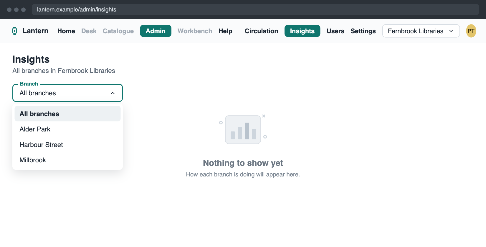
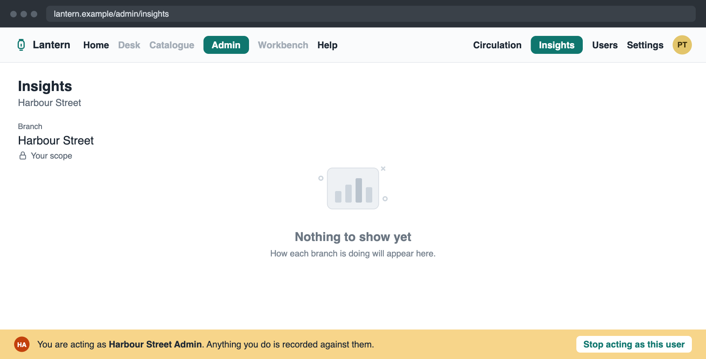
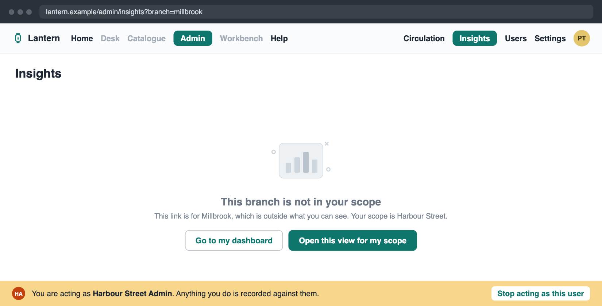
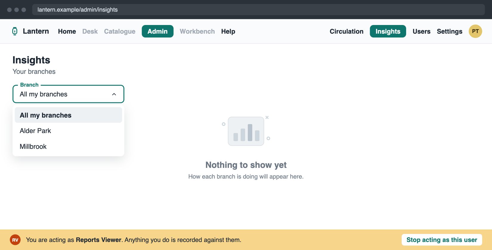

::::columns{#cover .slide .cover ratio="5:4"}

{.eyebrow}
LNT-418 · Lantern

# Administrator dashboard access

{.lead}
Who can open the dashboard, and which branches each person sees.

{.small}
Platform team · Demo · September 2026

::col

:::card[Who sees what]

| Person | Sees |
|---|---|
| System administrator | Every branch |
| Branch administrator | Their branch, locked |
| Reports viewer | Their own branches |
| Anyone else | No access |

:::

::::

{.notes}
> [!NOTE]- Speaker notes
> This is LNT-418, the second piece of the administrator dashboard. LNT-417 stored the numbers; this ticket decides who may open the dashboard, and how far each person can see. On the right is the whole answer in four lines: a system administrator sees every branch, a branch administrator sees their own branch and cannot change it, a Reports viewer sees the branches they belong to, and anyone else cannot open it.

::::card{#problem .slide}

{.eyebrow}
The problem

## Reading results and managing people are different jobs

:::grid{cols=2}
- ### Today

  The only way into the Admin area is the Administrator permission, which also lets its holder manage every user and their access.

- {.warn}
  ### What library systems need

  Someone who reads how the system is doing, without managing users. And a branch administrator who never sees another branch's staff or patrons.
:::

**So the dashboard needs its own way in,** and every screen needs to know how far each person may see.

::::

{.notes}
> [!NOTE]- Speaker notes
> Today the only way into the Admin area is the Administrator permission, and that permission also lets you manage every user and their access. In a library system those are usually different people. The system wants someone who can read how things are going without being able to change who has access. And a branch administrator must never see another branch's staff or patrons, by any route. So the dashboard needs its own way in, and every screen needs to know how far each person may see.

::::card{#change .slide .key}

{.eyebrow}
What changed

## A new permission, and an Insights tab in Admin

:::grid{cols=3}
- {.spotlight}
  ### Reports viewer

  "See how the system or branch is doing." Given and removed on the Users screen, beside Administrator and Catalogue editor.

- ### Insights tab

  The dashboard's home, beside Circulation, like the branch desk's Insights. Either permission opens it.

- ### Nothing else opens

  A Reports viewer cannot manage users. Circulation, Users and Settings still say "No permission".
:::

The tab is empty for now: this ticket builds its frame. The figures, bands and other filters come next.

::::

{.notes}
> [!NOTE]- Speaker notes
> Three things changed. First, a new permission called Reports viewer, described as "see how the system or branch is doing". A library system gives it and takes it away on the same Users screen as the other two, and every change is recorded in the user's history. Second, an Insights tab in the Admin area, next to Circulation, the same idea as the branch desk's Insights. Either the Administrator permission or Reports viewer opens it. Third, nothing else opens: a Reports viewer cannot manage users, and Circulation, Users and Settings still say No permission. The tab itself is empty for now; this ticket builds its frame, and the figures come in the next tickets.

::::card{#scope .slide}

{.eyebrow}
Which branches

## The server decides how far each person sees

| Person | Sees | Branch filter |
|---|---|---|
| System administrator | Every branch | "All branches", or pick any one |
| Branch administrator | Their own branch | Shown as fixed, marked "Your scope" |
| Reports viewer only | The branches they belong to | "All my branches", or one of them |
| Lantern support staff | The library system they chose | "All branches" |
| Anyone else | Nothing | The page is not open to them |

It comes from the staff roster the library system already sends. **Nothing the browser sends can widen it.**

::::

{.notes}
> [!NOTE]- Speaker notes
> This is the rule for how far each person sees, decided on the server every time. A system administrator sees every branch and can pick any of them. A branch administrator sees their own branch; the filter shows it as fixed, with a lock and the words Your scope. Someone who holds only Reports viewer sees the branches they belong to. Lantern support staff see the library system they chose. Anyone else cannot open the page. None of this is new data: it comes from the staff roster the system already sends. And nothing the browser sends can widen it; the page never even asks for a branch it is not allowed to have. The same rule now also drives the Users screen, which behaves exactly as before.

:::::card{#screens .slide .exhibit}

{.eyebrow}
On screen

## The same tab, two different people

::::columns

### System administrator

:::figure[Every branch in the list, All branches first.]

:::

::col

### Branch administrator

:::figure[Their branch, fixed, with a lock and Your scope.]

:::

::::

:::::

{.notes}
> [!NOTE]- Speaker notes
> Here is the tab from the browser check, with three test branches in a developer sandbox. On the left, a system administrator: the Branch filter lists every branch, with All branches first, and the header says All branches in Fernbrook Libraries. On the right, a branch administrator for Harbour Street: there is no dropdown at all, just the branch as fixed text with a lock and Your scope, which is what the pilot systems asked for. The header names the branch. The empty state underneath is where the figures go in LNT-419.

:::::card{#links .slide}

{.eyebrow}
Shared links

## A link opens in the reader's own scope

::::columns{ratio="4:5"}

### A branch they can see

Opens with that branch chosen.

### Another branch

No data. It names both branches and offers two ways on.

### A value that does not apply

Cleared, with a notice saying which and why.

::col

:::figure[A Harbour Street administrator opening a link to Millbrook.]

:::

::::

:::::

{.notes}
> [!NOTE]- Speaker notes
> Links are where scope is easiest to get wrong, so a link never fails and never shows too much. A link to a branch you can see opens with that branch chosen. A link to another branch shows no data at all: it says the branch is not in your scope, names the branch in the link and your own branch, and offers to open the same view for your scope or to go to your dashboard. That is the picture on the right. And a value in a link that does not apply, like a branch that does not exist, is cleared, with a notice saying which filter and why. The same rules will cover every filter the next tickets add.

:::::card{#viewer .slide .spotlight}

{.eyebrow}
A Reports viewer

## Admin opens straight on the dashboard

::::columns{ratio="4:5"}

:::steps
1. Clicking Admin lands on Insights, not Circulation
2. Only their own branches, under "All my branches"
3. Circulation, Users and Settings say "No permission"
:::

::col

:::figure[A Reports viewer for Alder Park and Millbrook. Harbour Street is not in the list.]

:::

::::

:::::

{.notes}
> [!NOTE]- Speaker notes
> Now someone who holds only Reports viewer, here belonging to Alder Park and Millbrook. Clicking Admin takes them straight to Insights, because Circulation is not open to them. The Branch filter offers All my branches and their two branches, and Harbour Street is not in the list at all. The other Admin tabs are still visible, as they are for desk staff, but each one says No permission. Hiding them was not in the ticket, and it would change what Workbench shows, so we left it for later.

::::card{#decisions .slide}

{.eyebrow}
Decisions

## Three decisions behind it

:::grid{cols=3}
- ### Its own way in

  Opening the whole Admin area to Reports viewers would have opened Users and Settings with it.

- ### One rule for every screen

  Every dashboard screen still to come uses the same rule, so no screen can let a branch administrator slip into another branch.

- ### Summaries across branches

  A branch administrator may compare totals with other branches, but never see their staff, patrons or alerts.
:::

::::

{.notes}
> [!NOTE]- Speaker notes
> Three decisions shaped this. First, the dashboard has its own way in. Opening the whole Admin area to Reports viewers would have opened Users and Settings with it, which is exactly what the new permission is meant to avoid. Second, one rule for every screen: the rule for which branches you see now lives in one place, and every dashboard screen the next tickets add will use it, so no single screen can apply it differently and let a branch administrator into another branch. Third, following the pilot systems' requirements, a branch administrator may compare their branch's totals with other branches, but never sees another branch's staff, patrons, holds or alerts. That split is built in now, ready for the comparison screens.

::::card{#proof .slide}

{.eyebrow}
Tested for real

## Every case, in a real browser and a sandbox

| What we tried | What happened |
|---|---|
| Administrator clicks Admin | Circulation, as before; Insights is a new tab |
| System administrator picks a branch | Header and link follow the choice |
| Branch administrator opens the tab | Their branch, fixed, "Your scope" |
| A link to another branch | No data; both branches named; both ways on work |
| A link to a made-up branch | Cleared, with a notice |
| Reports viewer clicks Admin | Lands on Insights, their two branches only |
| Reports viewer tries Circulation or Users | "No permission" |
| The Users screen | Unchanged for every kind of caller |
| Automated tests | All 8,640 pass, with new tests for each rule |

::::

{.notes}
> [!NOTE]- Speaker notes
> Every case was tried in a real browser against a sandbox, not only in automated tests, using three test branches and two test users. An Administrator clicking Admin still lands on Circulation, with Insights as a new tab. A system administrator picking a branch sees the header and the link follow. A branch administrator sees their branch fixed. A link to another branch shows no data and names both branches, and both buttons work. A made-up branch in a link is cleared with a notice. A Reports viewer lands on Insights with only their two branches, and gets No permission on Circulation and Users. The Users screen behaves exactly as before. The browser check also caught one small display bug, the Branch label overlapping its value, which is fixed. All automated tests pass.

::::card{#next .slide .exhibit}

{.eyebrow}
What comes next

## The next tickets fill the tab

:::grid{cols=3}
- `LNT-419`

  ### Figures, activity bands and the other filters, and the tab in Workbench

- `LNT-420`

  ### Loan distribution grid, with branch comparisons

- `LNT-421`

  ### Overdue and alerts tabs
:::

:::grid{cols=2}
- ### Left for later, on purpose

  - Hiding the Admin tabs a person cannot open
  - The Insights tab in Workbench's menu, once it has figures

- ### Found along the way

  Branch administrators can still read and change users in other branches on the Users side. Written up as tickets of their own.
:::

::::

{.notes}
> [!NOTE]- Speaker notes
> What comes next: the tickets that fill the tab. LNT-419 adds the figures, the activity bands and the other filters, and puts the tab into Workbench's menu. LNT-420 is the loan distribution grid, where branch administrators compare with other branches. LNT-421 is the overdue and alerts tabs. All of them read through the rule from this ticket. Two things were left for later on purpose: hiding the Admin tabs a person cannot open, and the Workbench menu item, which waits until the tab has figures. And along the way we found that branch administrators can still read, and change, users in other branches through the Users side. That is older than this ticket; it is written up as tickets of its own, and the shared rule from this ticket makes it easier to fix.

::::card{#appendix .slide .appendix}

{.eyebrow}
Technical appendix

## For engineers

| Piece | Where and what |
|---|---|
| Scope rule | `@lantern/shared/report-scope`: operator first, then no record means no branches, then `adminScopeBranchIds` |
| Record read | `report-scope-loader`: a consistent read of the caller's own `StaffRecord` |
| Branch list | `listReportBranches`, no arguments, in `staff-record-reader` |
| Server gate | `mayReadDashboard`: `systemAdmin` or `reportsViewer` |
| Feature area | `adminInsights`, parent area `admin`; `/admin` redirects by admission |
| Users screen | Same rule; a property test against a frozen copy pins no change |
| Records | ADR-0137; spec `platform/admin-dashboard-access` |

::::

{.notes}
> [!NOTE]- Speaker notes
> For the engineers. The scope rule lives in the shared package as report-scope: a support operator gets the library system first, a caller with no record gets no branches, and then the three states of adminScopeBranchIds apply, with absent falling back to the caller's own branchIds. report-scope-loader reads the caller's own record with a consistent read. listReportBranches takes no arguments and is served by the existing staff-record-reader. The authorizer admits it through mayReadDashboard, which the next dashboard queries share. The tab is its own feature area, adminInsights, declared as a child of admin, and /admin redirects each caller to the first tab they may open. The Users screen uses the same rule, and a property test against a frozen copy of the old rule pins that nothing changed there. The decision record is ADR-0137.
