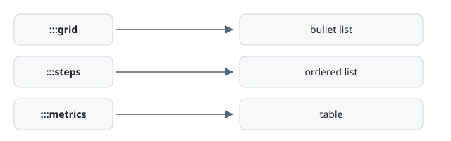

{.eyebrow}
Every construct, in use

# A tour of the v0 vocabulary

{.lead}
Every construct in the specification, shown at the size it would really be used rather than as a one-line snippet. On this site each one carries a **Markdown** tab holding the exact source that produced it, sliced out of this file, so the two can never disagree. The tabs are radio inputs, so nothing here runs a script.

[v0]{.badge .info} [8 constructs]{.badge} [No hand-written HTML]{.badge}

> [!NOTE]
> **What you are looking at.** One file. It renders as this page with `markset html`, as plain CommonMark with `markset downgrade`, and as itself in a GitHub comment. Nothing below is hand-written HTML, and nothing below is styled by the document: the source names roles, and a stylesheet decides what they look like.

{.tick}
***

{.eyebrow}
metrics

## Numbers that have a direction

A table of at least two columns becomes a row of tiles. The first column is the label, the second the value, and an optional third is read as a delta whose sign sets the direction. Below, `direction=inverse` is doing the work: these are costs, so a fall is the good news and the tiles colour accordingly.

:::metrics{direction=inverse}
| Measure | Value | Change |
|---|---|---|
| Cost per render | $0.004 | -18% |
| Median build | 0.45s | -0.2s |
| Failed builds | 3 | +1 |
:::

The same table with no third column gives label and value only, which is the right shape for facts that have no trend.

:::metrics
| Field | Value |
|---|---|
| Spec sections | 14 |
| Conformance cases | 361 |
| Invalid on purpose | 130 |
:::

{.tick}
***

{.eyebrow}
grid

## A list that reads as a set

`grid` takes exactly one list and turns its items into cards. That single rule is what makes the fallback exact: remove the fence and a list is still a list, in the same order, with the same content. Items can hold several blocks, so each one can be a small piece of writing rather than a line.

:::grid{cols=3}
- ### Semantic

  Authors name what a thing is. Whether it has a border is the theme's decision, and the document never says.

- ### Portable

  Every construct has a defined plain-CommonMark form, so the file still reads where the layout cannot follow.

- ### Checkable

  The vocabulary is closed, so a misspelled directive is a reported error rather than something passed through to the page.
:::

One item can be singled out without touching the others, by opening it with an attribute specifier. The third card below carries a class that this page's stylesheet does not define, which is the point: it reaches the HTML untouched and waits for a theme.

:::grid{cols=3}
- Ordinary item.
- Ordinary item.
- {.featured}
  Marked item, carrying `.featured` for a stylesheet to find.
:::

{.tick}
***

{.eyebrow}
columns · card

## Regions side by side

`columns` divides a region with `::col` separators. The `ratio` is the one piece of geometry a Markset document is allowed to carry, because relative column width is genuinely content: it says which side is the main one.

::::columns{ratio="2:1"}
The degradation contract is not aspirational. Each construct has a normative plain-CommonMark form, both forms are covered by the conformance suite, and a mechanical check confirms that a stock CommonMark parser sees the same blocks in the same order.

When these columns are lowered, they are emitted in source order, one after another. That is why the column that must be read first goes first.

::col

:::card[Try it]{tone=info}
Run `markset check` on this file, change `:::grid` to `:::widget`, and run it again to read the diagnostic.
:::
::::

A `card` is a titled surface around anything at all. `tone` picks one of five semantic names, and none of them is a colour.

:::card[Neutral]
The default, with no tone attribute at all.
:::

:::card[Information]{tone=info}
For context a reader needs but did not ask for.
:::

:::card[Caution]{tone=warn}
For something that will bite later if it is ignored now.
:::

{.tick}
***

{.eyebrow}
tabs

## One region, several answers

Tab labels are headings, so a renderer with no tab support shows the sections one after another and loses nothing. The panels switch with radio inputs, which is why this works in a printed page and in an email client.

:::tabs
### On the command line
```sh
npm i -g @markset-lang/cli
markset html showcase.md -o showcase.html
```

### As a library
```js
import { parseDocument } from "@markset-lang/parser";
import { renderHtml } from "@markset-lang/render-html";

const { ast, diagnostics } = parseDocument(source);
if (diagnostics.some((d) => d.severity === "error")) throw new Error("invalid document");
const html = renderHtml(ast);
```

### In CI
```sh
npx @markset-lang/cli check docs/*.md
```
:::

{.tick}
***

{.eyebrow}
steps

## A procedure that stays a procedure

`steps` takes exactly one ordered list. The numbering belongs to the list rather than to the construct, so the source reads as a procedure even before anything renders it, and a step can carry whatever a real instruction needs.

:::steps
1. ### Declare the version

   Add `markset: 0` to the frontmatter. Tools use it to decide that a `.md` file is meant to be Markset; the parser itself never requires it.

2. ### Wrap something you already wrote

   A list becomes a grid, a table becomes metrics. Both keep their meaning when the fence is removed, which is the test a construct has to pass to exist.

   ```sh
   markset check docs/deployment.md
   ```

3. ### Render it

   Every error the validator reports is specified behavior rather than a parser accident, so a document either builds or tells you precisely where it did not.
:::

{.tick}
***

{.eyebrow}
figure

## Content with a caption

A figure wraps a single image, table or code block and gives it a caption. `width` accepts percentages only, because the same source has to typeset to print, where a pixel means nothing.

:::figure[Every construct wraps a CommonMark primitive, which is what makes the fallback mechanical rather than a matter of taste.]{#fig-degrade width=80%}

:::

A table works too. When the content is a table the caption is emitted as the table's own `<caption>` element, because that is what a screen reader announces as the table's name.

:::figure[Where each construct's content rule comes from, and what it buys.]
| Construct | Content rule | What the rule guarantees |
|---|---|---|
| `grid` | Exactly one list | The fallback is the list, in order |
| `steps` | Exactly one ordered list | The numbering survives |
| `metrics` | One table, two columns or more | The fallback is a readable table |
| `figure` | One image, table or code block | The caption always has one thing to caption |
:::

{.tick}
***

{.eyebrow}
callout

## Advice that stands apart

Callouts adopt GitHub's alert syntax unchanged, so the bare marker renders natively there. A title on the marker line and a fold suffix are Obsidian's extension; where those are not understood, the callout falls back to a blockquote that still says what it is.

> [!TIP] Five types, no more
> `NOTE`, `TIP`, `IMPORTANT`, `WARNING` and `CAUTION`. Anything else is an error rather than a new kind of callout, which is what a closed vocabulary means in practice.

> [!WARNING] The fence length rule
> A closing fence closes the innermost open directive. Nesting a three-colon construct inside another means the outer one needs four. This is the rule that catches everyone once.

> [!CAUTION]- Folded by default
> A trailing `-` collapses a callout and a `+` expands it. It becomes a `<details>` element, so folding costs no script. This one started closed.

{.tick}
***

{.eyebrow}
spans · attribute lines

## The two pieces that are not containers

Every section above opens a container with a fence. Two smaller pieces of syntax do the rest of the work, and neither one contains anything: they attach attributes to something that is already there.

A **bracketed span** attaches them to a run of inline text. It is how a status marker, or a phrase meant to read quietly, gets into the middle of a sentence without a box around it.

:::card[Four spans and some ordinary text]
Release [v0.3.0]{.badge}, status [Draft]{.badge .warn}, target [on track]{.success}. The words between the markers are plain text, and [this phrase]{.muted} is a span as well.
:::

An **attribute line** attaches them to a block instead. A paragraph, heading, list or table has nowhere to write a specifier of its own, so the specifier goes on a line by itself and applies to whatever starts on the next line. The two columns below hold the same sentence. Only the right one has a line in front of it.

:::columns{ratio="1:1"}
No attribute line here, so this paragraph is set at body size like any other.

::col

{.lead}
An attribute line carrying `.lead` sits above this one, so it is set larger.
:::

Between them, every block and every run of text in a document can be named without a construct existing for it. That is what keeps the vocabulary at eight rather than growing one entry for every typographic need.

{.tick}
***

{.small .muted}
Source: `examples/showcase.md`. The document names no stylesheet of its own; that choice belongs to whoever renders it. Each **Markdown** tab above is sliced from this file by the position of the construct it sits on, so it is the real source rather than a copy of it.
