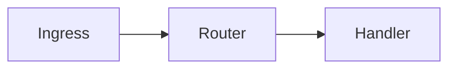

{.eyebrow}
Reference · not a construct

# Diagrams

{.lead}
A diagram is a fenced code block whose info string names a diagram language. There is no `:::diagram` directive and there will not be one, because a code fence already gives independent renderers everything they need to agree on. What this page describes is the part that did need settling: what a renderer is allowed to do with such a fence, and what it must never do.

[Spec §10]{.badge .info} [No new syntax]{.badge} [Works in plain CommonMark]{.badge}

> [!NOTE]
> **What an engine is, on this page.** An engine is whatever turns a diagram fence into a picture: a function built into the renderer — Markset ships one, for `ascii` — or a program you name when you render, such as mermaid's `mmdc`. Markset never goes looking for one on its own. A fence whose language has no engine stays a code block, which is a correct rendering rather than a failure.

{.tick}
***

{.eyebrow}
The short version

## Write the fence, wrap it in a figure

:::figure[How a request reaches a handler. This picture was an ASCII fence in the source of this page.]{#fig-flow}
```ascii
  +---------+      +----------+      +---------+
  | Ingress |----->|  Router  |----->| Handler |
  +---------+      +----------+      +---------+
                        |
                        |  no match
                        v
                   +-----------+
                   |  404 page |
                   +-----------+
```
:::

That figure is not an image file and not hand-written HTML. It is this, in the page source:

````markdown
:::figure[How a request reaches a handler.]{#fig-flow}
```ascii
  +---------+      +----------+      +---------+
  | Ingress |----->|  Router  |----->| Handler |
  +---------+      +----------+      +---------+
                        |
                        |  no match
                        v
                   +-----------+
                   |  404 page |
                   +-----------+
```
:::
````

Both halves already existed. A fenced code block is CommonMark, and `figure` has always accepted a code block as its content. Nothing about the grammar changed to make this work.

{.tick}
***

{.eyebrow}
Why ASCII

## The fallback is already a diagram

This is the part that is about Markset rather than about diagrams, and it is the reason ASCII is the recommended source.

Every construct in Markset has to read where the layout cannot follow — a GitHub comment, a terminal, a plain-text mail, a diff, the output of `markset downgrade`. That is the degradation contract, and it is what the whole format is arranged around.

:::grid{cols=2}
- ### A `mermaid` fence falls back to source

  Ten lines of `flowchart LR` and `A[Ingress] --> B{Route?}`. Honest, complete, and not a diagram. A reader in a terminal gets a program, and has to run it in their head.

- ### An `ascii` fence falls back to a diagram

  Because it already was one. The same characters that the engine turns into boxes and arrows are boxes and arrows to a person reading the raw file.
:::

Both are on this page below, and **both are drawn** — this site registers an engine for each. So the difference is not in the picture, and the pictures are not the point. The difference is the second block in each column: what is left of that diagram somewhere the drawing cannot happen.

::::columns{ratio="1:1"}
:::figure[mermaid, drawn by its own command line.]

:::

{.small .muted}
And in a pull request, a terminal, a plain-text mail:

```text
flowchart LR
  Ingress --> Router
  Router --> Handler
```

::col

:::figure[ascii, drawn by the built-in engine.]
```ascii
+---------+    +--------+    +---------+
| Ingress |--->| Router |--->| Handler |
+---------+    +--------+    +---------+
```
:::

{.small .muted}
And in a pull request, a terminal, a plain-text mail:

```text
+---------+    +--------+    +---------+
| Ingress |--->| Router |--->| Handler |
+---------+    +--------+    +---------+
```
::::

The bottom left is a set of instructions for a picture. The bottom right is a picture. Of the common diagram sources ASCII is the only one whose unrendered form is as good as its rendered form, which is what makes it the one that fits the degradation contract rather than merely surviving it. Renderers may draw anything they like; authors who care about where their document ends up should reach for ASCII first.

> [!TIP] It is readable before anything runs
> Open this page's source on GitHub and the diagram above is still a diagram. That is not a fallback in the apologetic sense. For a lot of documents it is the only form anyone will ever see.

{.tick}
***

{.eyebrow}
What a renderer may do

## Seven obligations

:::figure[The rules a conformant renderer follows, from spec §10.]
| # | Obligation |
|---|---|
| 1 | A renderer that does not draw a language renders it as a code block. This is always correct. |
| 2 | A renderer that does draw it may replace the code block in HTML output. |
| 3 | Drawing never changes the AST. A diagram is a `code` node before and after. |
| 4 | The downgrade output is the code block, unchanged, always. |
| 5 | If drawing fails, the code block stays. A failed diagram never removes content. |
| 6 | A drawn form is inert: no script, no fetch at display time. |
| 7 | A renderer must not draw a diagram it has no text alternative for. |
:::

Obligation 1 is the one that keeps the language set open. There is no list of approved diagram languages, and `markset check` reports nothing for a language it has never heard of, because a renderer that cannot draw one is already behaving correctly by leaving it alone.

{.tick}
***

{.eyebrow}
Obligation 7

## A drawn diagram must be captioned

The rule with teeth, and the one most likely to surprise. **A diagram fence that is not the content of a captioned `figure` is rendered as a code block**, however capable the renderer is.

The reason is worth spelling out. An undrawn diagram is a code block, so a reader using a screen reader gets its source: mediocre, but present. Draw it with no text alternative and that reader gets nothing at all — so drawing would *remove* content for them while adding it for everyone else. The caption is the alternative, and `figure` is the only place in the grammar a fence can carry one.

::::columns{ratio="1:1"}
:::card[Drawn]{tone=info}
Inside a `figure` with a caption. The caption becomes the picture's `alt` text as well as its visible label.
:::

::col

:::card[Left as a code block]
A bare fence, or a `figure` with no caption argument. Nothing is lost and nothing is claimed.
:::
::::

This is the same move as the [tabs](../tabs/index.html) page's refusal to emit tab roles: the output claims only what it can keep true.

{.tick}
***

{.eyebrow}
Drawing them

## Rendering with the command line

**`ascii` fences are drawn by default.** The reference implementation ships one engine and uses it without being asked, because an ASCII fence that is drawn and an ASCII fence that is not are the same picture — drawing it changes how it looks, not what it says. Every other language needs a command, and `--diagram none` turns drawing off entirely for a fence that is meant to stay selectable text.

:::tabs
### Built-in ASCII

```sh
markset html doc.md -o doc.html      # ascii fences are drawn
markset html doc.md --diagram none   # and this keeps them as code
```

The reference implementation ships one built-in engine, for `ascii`. It is a pure function with no dependencies: it reads the grid, joins the runs of `-` and `|`, puts an arrowhead where a line actually arrives, and sets everything else as text.

### Any other engine

```sh
markset html doc.md --diagram mermaid="mmdc -i /dev/stdin -o /dev/stdout"
markset html doc.md --diagram bob="svgbob"
```

The fence's contents go to the command on stdin; SVG comes back on stdout. A command that exits non-zero, or prints something that is not SVG, leaves the code block in place and reports to stderr. Naming a language here adds it; `ascii` keeps drawing alongside it.

### As a library

```js
import { renderHtml } from "@markset/render-html";

renderHtml(ast);                                        // ascii is drawn
renderHtml(ast, { diagrams: false });                   // nothing is drawn
renderHtml(ast, { diagrams: { engines: { mermaid } } }); // ascii and mermaid
```

An engine you register is layered over the built-in one, so adding a language never silently takes `ascii` away.
:::

> [!IMPORTANT] A document never names its own engine
> The mapping from info string to command comes from the flag and nowhere else, and the fence's contents reach the command on stdin rather than being pasted into it. Nothing written in a Markset file can cause anything to run. Invariant 4 is intact: choosing a build step is the operator's decision, exactly as running `markset` at all already was.

{.tick}
***

{.eyebrow}
What gets emitted

## The drawn form

A drawn diagram replaces the `<pre>` with an image:

```html

```

The reference implementation draws to SVG and embeds it as a `data:` URI rather than inlining the markup. Markset never passes raw HTML from a document through to output, and an engine — which on the command line is an arbitrary command — should not get a channel that documents are denied. An SVG loaded through `` cannot execute script, so obligation 6 holds because of the shape of the output rather than because the engine was trusted.

The built-in engine carries its own `prefers-color-scheme` block, which resolves against the page's color scheme, so a diagram follows the [light and dark control](../../index.html) in the bar above like everything else on the page. Try it: the picture at the top of this page changes with it.

{.tick}
***

{.eyebrow}
The supported subset

## What the built-in engine understands

:::figure[Everything the ASCII engine recognizes. Anything else on the line is set as text.]
| Characters | Meaning |
|---|---|
| `-` | Horizontal line |
| `\|` | Vertical line |
| `+` | Corner or junction, where lines meet |
| `/` `\` | Diagonal |
| `>` `<` `^` `v` | Arrowhead, but only where a line actually arrives |
| anything else | Text, positioned on the character grid |
:::

The last two rows are the ones that matter in practice. An arrowhead is only an arrowhead where a line arrives at it, which is what stops the `v` in "very" from sprouting a triangle. And there is no layout pass: a diagram is drawn exactly where you put it, cell by cell, so the alignment in the rendered picture is the alignment in your file.

:::figure[Diagonals and junctions, drawn from the same grid.]
```ascii
        +----+
        | in |
        +----+
          |
     +----+----+
     |         |
     v         v
  +-----+   +-----+
  |  a  |   |  b  |
  +-----+   +-----+
     \         /
      \       /
       +-----+
       | out |
       +-----+
```
:::

{.small .muted}
The engine is deliberately small and deliberately not `svgbob`. If you want rounded corners, shape detection and styling hints, point `--diagram` at a tool that does those things — that is what the flag is for.
